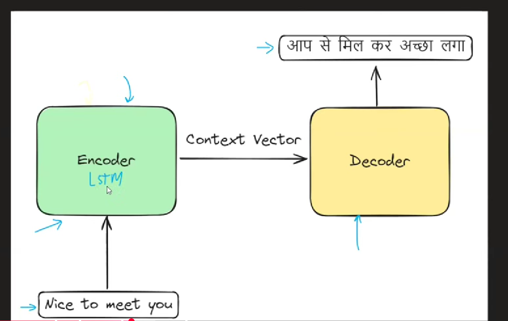
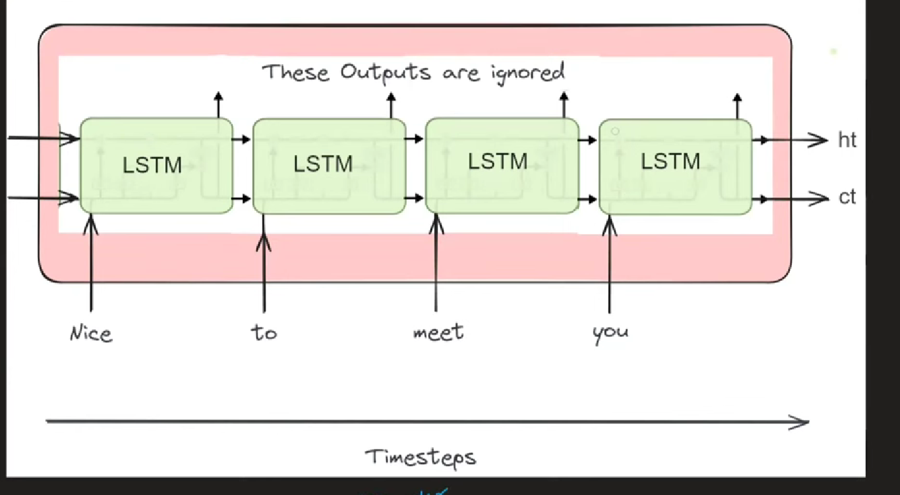
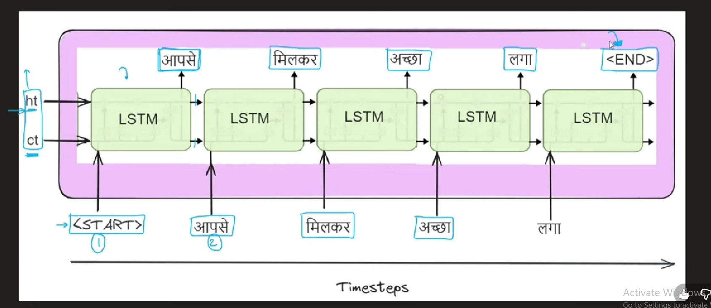
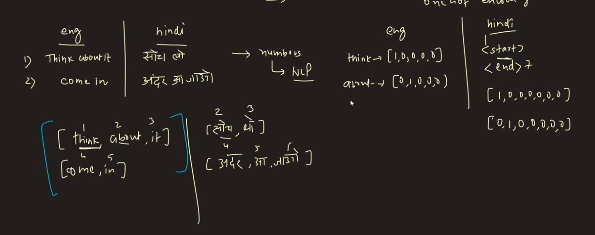
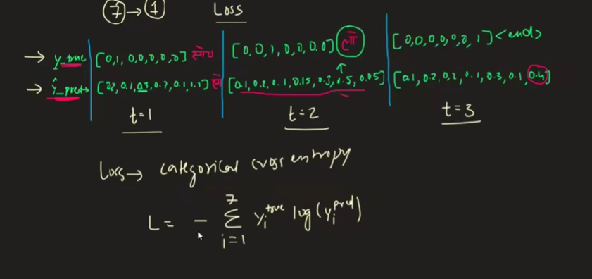
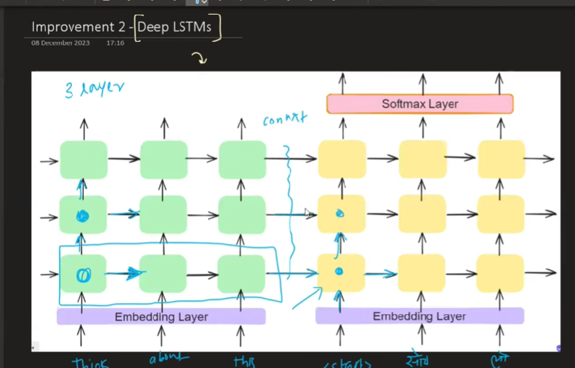

- Encoder/Dec

- one LSTM cell

- LSTM / GRUS both can be used
ht = hidden state
ct = cell state
- This outputs context vector

- ht, ct (encoder, end) = ht, ct = (decoder, start)
- by seeing start it starts prod ouptut
- first word (output) -> input to lstm
- by seeing end dec stops

- Some times, the first pred is wrong if the y-true = jan, y_pred = lo
- so instead of passing y_pred, we pass y_true to the next lstm in dec
- just like any deep learning it does forward and then backward prop by doing loss cal
- cal loss for each time loss (all 7 classes)

7 classes = start jan lo soch is mein end

In the pred:
we just send y_pred to the next lstm

### Improvements

**1 - Embeddings**
- low dimension, dense -> capture most
- Uptil now we used vectors
- n dim vector rep

**2 - Deep LSTM**
- deep learning (with hidden states)
- 3 layer lstm 

**3 - Reverse input**

- distance between first input word has less distance from first word output
- works only for languages where first word contains most context
 

**If attention mechanism works great why do we need attention mechanism?** [click](attention_mech.md)
