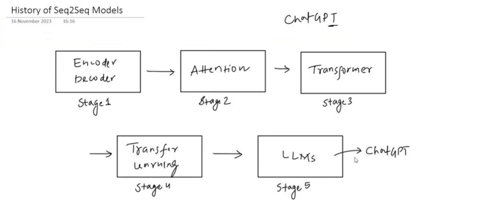
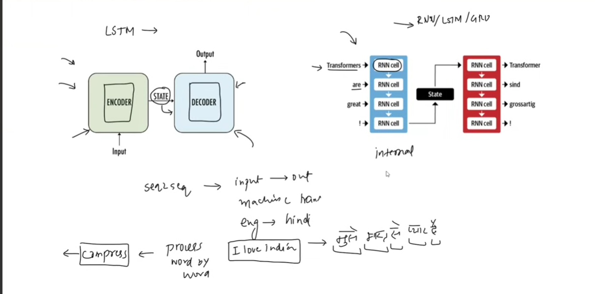
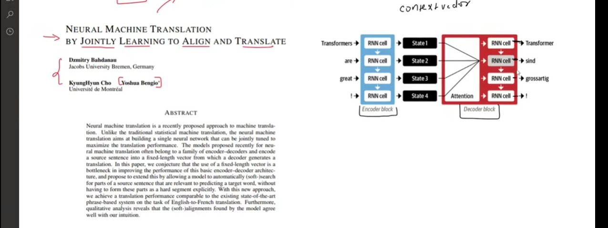
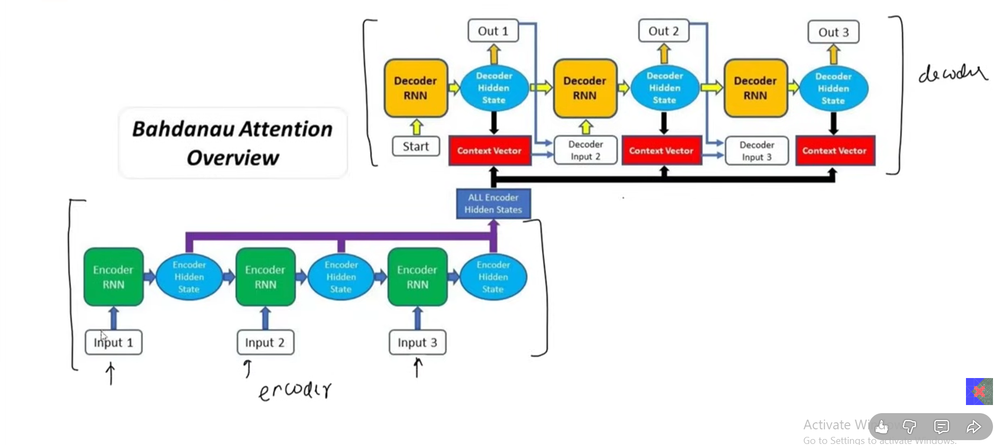

Need to work with Seq2Seq Models 

RNN – bioinformatics, sequences, language and sentences 

RNN Types 

- One to many 
- Many to one 
- Sync Many to many *(Inputs = Outputs, for every word; part of speech, ner: for every entity give name)* 
- Async Many to many *(4 timesteps – 2 timesteps Language Translation)*

**Seq2Seq** models were invented to solve async many to many (length of inp seq differ from output) 

Eg: Text summarixation, q and a, speech to text 

 

Seq to Seq history  

 

Encoder dec arch 2014 (Ilya, Google) 

 
 
But this system failed for longer sentences. 

- Because, word by word input goes to enc 
- Enc summaries that into a vector (context vector) 
- Lead to memory loss 

 

**Instead of one state, all states of encoder are available**

Attention mechanism  
 

Paper: Neural machine translation by jointly learning to alighn and translate 

  
 

Disadvantage: Training time was increasing 

- For each word in the output, you must calculate similarity against all the inputs 

- Calculation were  linear (dis of lstm), we need some kind of parallel processing 

That’s where **transformers** come in  

Paper: attention is all you need (VERY IMP TO READ) 

- LSTM/rnn were ditched 
- Attention is all they need (they implemented self attention) 
- While encode and decoder remains, they rather use attention called self attention 
- Can see all the words in input at a time 

Disadvantage:

- Hardware 
- Data 
- Transfer Learning  

Paper: ULMFit 

Transfer learning was only used in computer vision but now this can be used in NLP tasks as well 

 

**Why was Transfer learning not used in NLP uptil now?**

Task specific (one model trained for task performing others eg ml trained used for summarization, pos tagging etc but because of lack of labelled data people who tried to apply ml to other areas couldn’t do that) 

For machine trans, data should be  

One col : English, 2nd col: Urdu 

So instead, they pretrained for language modelling which is called unsupervised task 

Then came google bert (encoder) and gpt (decoder) based on transformer arch but because being trained on such large data; it was phenomenal for transfer learning, today known as  

 

One most impt thing for chatgpt: 

- First it was trained on supervised data (q/a from reddit etc) 

- Applied RLHF (reinforcement learning from human feedback) 

 