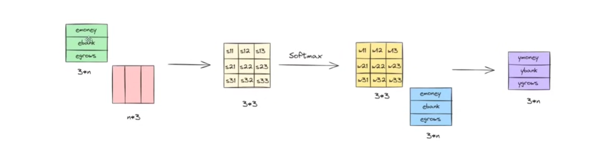

### Transformers

### Impact 
- genai 
- multimodal capabilities

## Origin
1 - Seq to Seq Learning with NN
2- Neural Machine Translation (solves attention issue by using weighted sum of multiple context vectors; certain words influence and carry more meanning)
3 - Attention is all you need (solves the issue in sequential issue that comes with lstm)

## 1 - Self Attention

*What is the most imp thing for nlp?*
- Converting words into numbers
- BOG, TFIDF
- But, totally revoltionary is word embedding; captures semantic meaning

### Issue with Word Embedding 
- Word "Apple" could be fruit or company
- the number of sample will influence whether final meaning is company or fruit
- this is called static embedding but it should adapt dynamically, by using other words in that sentence
- our transformer, trained once think apple is fruit

- money (new) embedding = 0.7emoney + 0.2ebank + 0.1egrows
- Bank (new) embedding = 0.25emoney + 0.7ebank + 0.05egrows
\
0.7 is sim between emoney and emoney and for other words as well
\
ebank(new) = [ebank.eTbank]emoney + [ebank.eTbank]ebank+[ebank.eTgrows]egrows
\
[ebank.eTbank] = 0.7 = w22 (Image 3)

### Image 3

**The above can be done in parallel using linear alg given below which is what transformers can do 💡💡**

- until now we are generating general context embedding
- piece of cake would be 'cake ka tukra' in this scene
- in reality its ' asasn'
- we need to do task specific contextual embedding (different type for sentiment analysis and different for machine translation)
- for the task specific nature, we need to introduce weights which can be done either before softmax or after softmax. 

**Below, green boxes ask red boxes *how similar are we?* which can be termed as querying.**

In other words green = query, red = key, blue = values
\
so any word embedding can be used as key, value and query
\ 
*but rn one vector is doing query, key and values all of it which is not a good practice*
