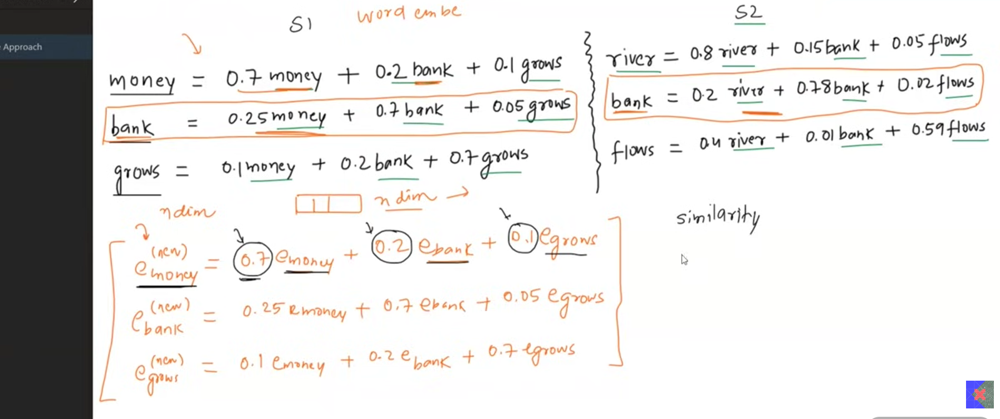
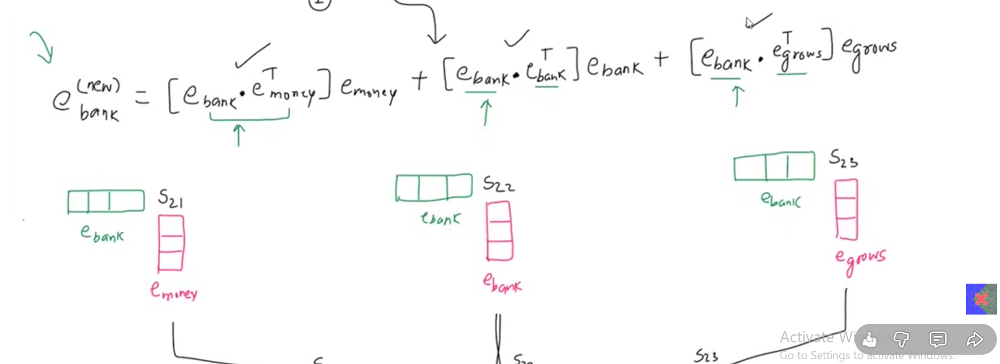
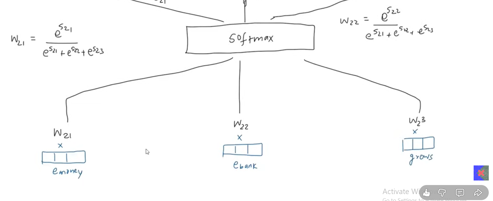
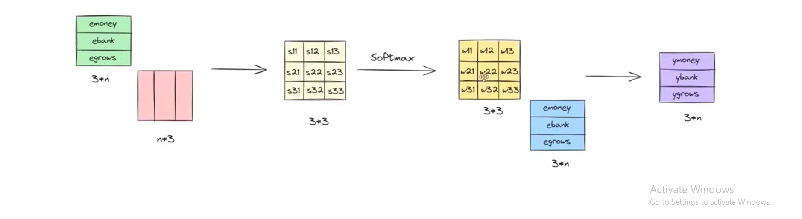

### Transformers

### Impact 
- genai 
- multimodal capabilities

## Origin
1 - Seq to Seq Learning with NN
2- Neural Machine Translation (solves attention issue by using weighted sum of multiple context vectors; certain words influence and carry more meanning)
3 - Attention is all you need (solves the issue in sequential issue that comes with lstm)

## 1 - Self Attention

*What is the most imp thing for nlp?*
- Converting words into numbers
- BOG, TFIDF
- But, totally revoltionary is word embedding; captures semantic meaning

### Issue with Word Embedding 
- Word "Apple" could be fruit or company
- the number of sample will influence whether final meaning is company or fruit
- this is called static embedding but it should adapt dynamically, by using other words in that sentence
- our transformer, trained once think apple is fruit

- money (new) embedding = 0.7emoney + 0.2ebank + 0.1egrows
 sim between emoney and emoney

- until now we are generating general context embedding
- piece of cake would be 'cake ka tukra' in this scene
- in reality its ' asasn'
- we need to do task specific contextual embedding

[- restart from progress](https://www.youtube.com/watch?v=-tCKPl_8Xb8) 
