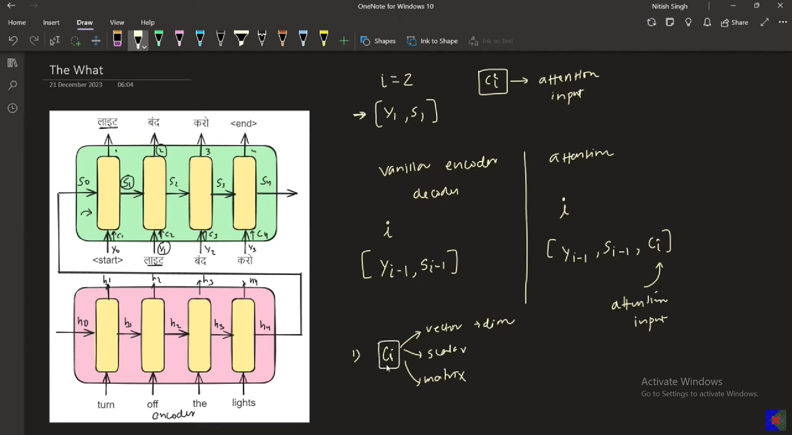

## Why we need attention mechanism?

### When paragraphs get longers, it becomes harder for enc/dec to remember 
- Because after encoder see input they have to produce vector (summary)
- Issue for decoding as well, while prod output word, it has to look at the entire sentence (rather than looking at one particular word that is being translated)
- for decoder, need to dynamically generate which time steps of encoder are imp for you?

dim of h  = dim of c
what if we need to send two hs (two cs)?
*weighted sum*

## Results of using attention mech
- on the left - bleu is high when using attention mech
- on the right - words' translation actually depends on a particular word

[Paper](https://arxiv.org/pdf/1409.0473)