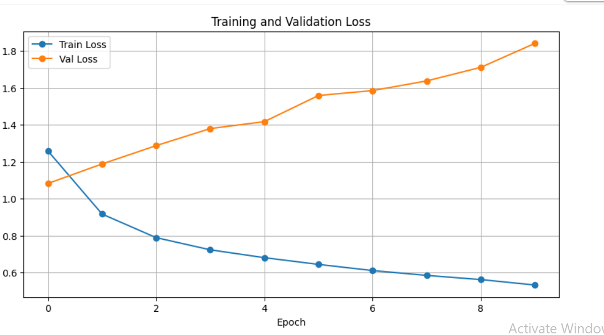
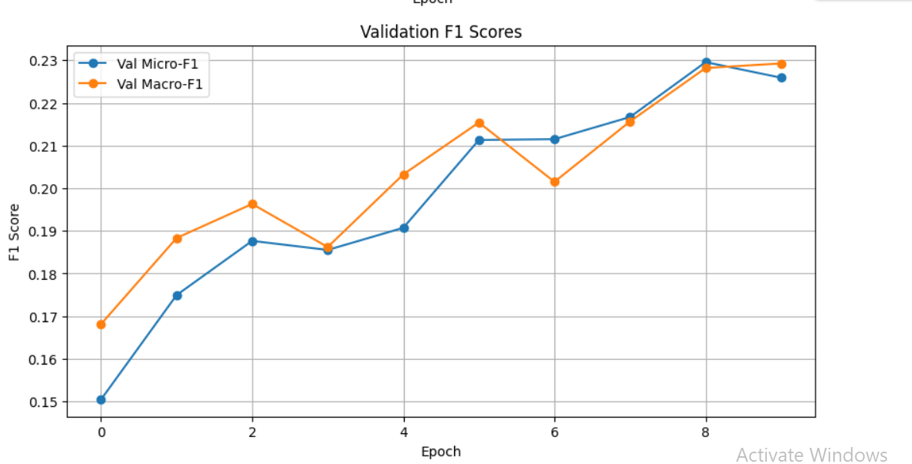

## Training Encoder from Scratch For Emotion Classifiers

### Training 

---
| First Experiment | Description | Time | 
| :------------------ | :-------------------: |-------------------: |
| Less Complex Architecture | | 60 min |
| Complex Architecture | | 

### Challenges
- Severe label imbalance: **neutral** dominates the dataset (44k vs 2k–7k for others).
    - The model quickly learns “neutral” but struggles with rare emotions.
    - 💡Macro-F1 climbing slowly - struggling with rare emotions

- Shallow transformer (2 layers): limited capacity to model nuanced emotion patterns.

- No pretrained embeddings: you’re starting from scratch — no semantic prior like BERT.

- Loss type: BCEWithLogitsLoss doesn’t adjust for class imbalance unless you give pos_weight.

- Input truncation (max_len=128): emotions sometimes depend on full context.

### Fix
- Add pos_weight in BCE loss to handle rare emotions.

- Use pretrained encoder (e.g., bert-base-uncased) as the embedding layer, freeze for few epochs.

- Increase d_model (e.g., 512) and num_layers (to 4).

- Apply weighted sampling or class-balanced loss.


### First Architecture 
``` 

      ━━━━━━━━━━━━━━━━━━━━━━━━━━━━━━━━━━━━━━━━ 51.8/51.8 kB 2.4 MB/s eta 0:00:00
  Preparing metadata (setup.py) ... done
   ━━━━━━━━━━━━━━━━━━━━━━━━━━━━━━━━━━━━━━━━ 104.1/104.1 kB 5.3 MB/s eta 0:00:00
  Building wheel for rouge-score (setup.py) ... done

=== Epoch 1/10 ===
Train Loss: 0.1343 | Val Loss: 0.1229 | Val Micro-F1: 0.2514 | Val Macro-F1: 0.1497
Saved best model.

=== Epoch 2/10 ===
Train Loss: 0.1204 | Val Loss: 0.1192 | Val Micro-F1: 0.2963 | Val Macro-F1: 0.1959
Saved best model.

=== Epoch 3/10 ===
Train Loss: 0.1157 | Val Loss: 0.1178 | Val Micro-F1: 0.3132 | Val Macro-F1: 0.2164
Saved best model.

=== Epoch 4/10 ===
Train Loss: 0.1118 | Val Loss: 0.1174 | Val Micro-F1: 0.3272 | Val Macro-F1: 0.2373
Saved best model.

=== Epoch 5/10 ===
Train Loss: 0.1085 | Val Loss: 0.1175 | Val Micro-F1: 0.3230 | Val Macro-F1: 0.2347
No improvement for 1 epoch(s).

=== Epoch 6/10 ===
Train Loss: 0.1055 | Val Loss: 0.1188 | Val Micro-F1: 0.3373 | Val Macro-F1: 0.2517
Saved best model.

=== Epoch 7/10 ===
Train Loss: 0.1028 | Val Loss: 0.1196 | Val Micro-F1: 0.3455 | Val Macro-F1: 0.2625
Saved best model.

=== Epoch 8/10 ===
Train Loss: 0.1004 | Val Loss: 0.1205 | Val Micro-F1: 0.3484 | Val Macro-F1: 0.2559
Saved best model.

=== Epoch 9/10 ===
Train Loss: 0.0983 | Val Loss: 0.1216 | Val Micro-F1: 0.3446 | Val Macro-F1: 0.2588
No improvement for 1 epoch(s).

=== Epoch 10/10 ===
Train Loss: 0.0964 | Val Loss: 0.1226 | Val Micro-F1: 0.3430 | Val Macro-F1: 0.2679
No improvement for 2 epoch(s).
Loaded best model from epoch 8 val_micro_f1= 0.3484032910333287

=== TEST RESULTS ===
Test Loss: 0.1215
Test Micro-F1: 0.3480
Test Macro-F1: 0.2499
Test Precision (micro): 0.5689, Recall (micro): 0.2507
admiration  : F1=0.482
amusement   : F1=0.509
anger       : F1=0.217
annoyance   : F1=0.084
approval    : F1=0.131
caring      : F1=0.182
confusion   : F1=0.193
curiosity   : F1=0.313
desire      : F1=0.263
disappointment: F1=0.050
disapproval : F1=0.048
disgust     : F1=0.175
embarrassment: F1=0.148
excitement  : F1=0.153
fear        : F1=0.377
gratitude   : F1=0.803
grief       : F1=0.000
joy         : F1=0.312
love        : F1=0.588
nervousness : F1=0.078
optimism    : F1=0.305
pride       : F1=0.107
realization : F1=0.062
relief      : F1=0.076
remorse     : F1=0.215
sadness     : F1=0.337
surprise    : F1=0.349
neutral     : F1=0.439

```

### Post Application of WeightedRandomSampler, pos_weight in BCEWithLogitsLoss

The performance of the model worsened because of over accounting for data imbalance (sampler and pos_weight)

```
      ━━━━━━━━━━━━━━━━━━━━━━━━━━━━━━━━━━━━━━━━ 51.8/51.8 kB 3.2 MB/s eta 0:00:00
  Preparing metadata (setup.py) ... done
   ━━━━━━━━━━━━━━━━━━━━━━━━━━━━━━━━━━━━━━━━ 104.1/104.1 kB 6.9 MB/s eta 0:00:00
  Building wheel for rouge-score (setup.py) ... done

=== Epoch 1/10 ===
Train batches: 100% 2640/2641 [09:39<00:00,  4.71it/s]Eval batches: 100% 331/331 [00:29<00:00, 12.62it/s]Train Loss: 1.2581 | Val Loss: 1.0824 | Val Micro-F1: 0.1504 | Val Macro-F1: 0.1681
Saved best model.

=== Epoch 2/10 ===
Train batches: 100% 2640/2641 [09:40<00:00,  4.71it/s]Eval batches: 100% 330/331 [00:29<00:00,  8.59it/s]Train Loss: 0.9164 | Val Loss: 1.1880 | Val Micro-F1: 0.1749 | Val Macro-F1: 0.1883
Saved best model.

=== Epoch 3/10 ===
Train batches: 100% 2640/2641 [09:36<00:00,  4.68it/s]Eval batches:  99% 329/331 [00:29<00:00, 11.44it/s]Train Loss: 0.7886 | Val Loss: 1.2873 | Val Micro-F1: 0.1876 | Val Macro-F1: 0.1963
Saved best model.

=== Epoch 4/10 ===
Train batches: 100% 2640/2641 [09:35<00:00,  4.71it/s]Eval batches: 100% 330/331 [00:29<00:00,  8.58it/s]Train Loss: 0.7227 | Val Loss: 1.3797 | Val Micro-F1: 0.1855 | Val Macro-F1: 0.1862
No improvement for 1 epoch(s).

=== Epoch 5/10 ===
Train batches: 100% 2640/2641 [09:37<00:00,  4.59it/s]Eval batches: 100% 330/331 [00:29<00:00, 11.93it/s]Train Loss: 0.6801 | Val Loss: 1.4174 | Val Micro-F1: 0.1907 | Val Macro-F1: 0.2032
Saved best model.

=== Epoch 6/10 ===
Train batches: 100% 2640/2641 [09:38<00:00,  4.73it/s]Eval batches:  99% 329/331 [00:29<00:00, 11.72it/s]Train Loss: 0.6437 | Val Loss: 1.5589 | Val Micro-F1: 0.2113 | Val Macro-F1: 0.2154
Saved best model.

=== Epoch 7/10 ===
Train batches: 100% 2640/2641 [09:35<00:00,  4.71it/s]Eval batches: 100% 330/331 [00:29<00:00, 11.80it/s]Train Loss: 0.6104 | Val Loss: 1.5856 | Val Micro-F1: 0.2115 | Val Macro-F1: 0.2015
Saved best model.

=== Epoch 8/10 ===
Train batches: 100% 2640/2641 [09:36<00:00,  4.71it/s]Eval batches: 100% 330/331 [00:29<00:00, 11.68it/s]Train Loss: 0.5840 | Val Loss: 1.6380 | Val Micro-F1: 0.2167 | Val Macro-F1: 0.2157
Saved best model.

=== Epoch 9/10 ===
Train batches: 100% 2640/2641 [09:36<00:00,  4.67it/s]Eval batches: 100% 330/331 [00:29<00:00,  9.84it/s]Train Loss: 0.5615 | Val Loss: 1.7115 | Val Micro-F1: 0.2296 | Val Macro-F1: 0.2282
Saved best model.

=== Epoch 10/10 ===
Train batches: 100% 2640/2641 [09:34<00:00,  4.61it/s]Eval batches: 100% 330/331 [00:29<00:00, 10.40it/s]Train Loss: 0.5319 | Val Loss: 1.8413 | Val Micro-F1: 0.2259 | Val Macro-F1: 0.2293
No improvement for 1 epoch(s).
Loaded best model from epoch 9 val_micro_f1= 0.22956794574165484
Eval batches:  99% 329/331 [00:29<00:00, 11.81it/s]
=== TEST RESULTS ===
Test Loss: 1.7286
Test Micro-F1: 0.2278
Test Macro-F1: 0.2261
Test Precision (micro): 0.1419, Recall (micro): 0.5764
admiration  : F1=0.426
amusement   : F1=0.441
anger       : F1=0.206
annoyance   : F1=0.209
approval    : F1=0.216
caring      : F1=0.193
confusion   : F1=0.241
curiosity   : F1=0.344
desire      : F1=0.169
disappointment: F1=0.135
disapproval : F1=0.211
disgust     : F1=0.157
embarrassment: F1=0.110
excitement  : F1=0.148
fear        : F1=0.213
gratitude   : F1=0.525
grief       : F1=0.133
joy         : F1=0.204
love        : F1=0.491
nervousness : F1=0.105
optimism    : F1=0.219
pride       : F1=0.058
realization : F1=0.148
relief      : F1=0.131
remorse     : F1=0.323
sadness     : F1=0.225
surprise    : F1=0.180
neutral     : F1=0.171


```



### Removal of random sampling which was over-compensating rare labels

