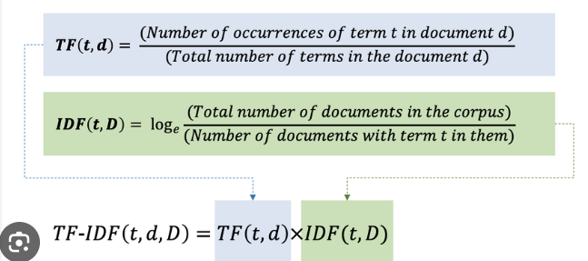
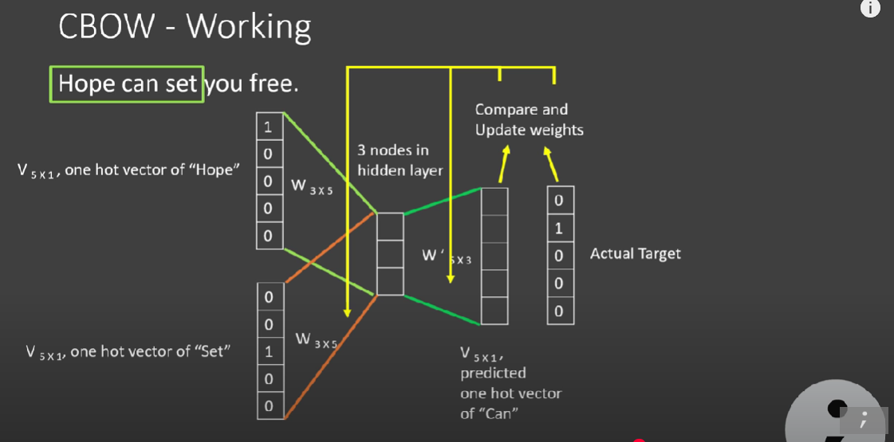

## Word Meaning

A computer can not tell the literal meaning of a word. It can't prcoess text. Moreover similar meaning words eg. semantic domain, sentiment, synonyms can not be figured out by computer on its own.

- ### Synonyms

vanish, disappear.

- ### Sentiment

happy, good

- ### Semantic 

Hospitals, nurses, surgical instruments etc

## What is the sol to word meaning for computers?

### Computational Models
1 - Defining meaning by ling dist

2 - Meaning as a point in multi-dim space (dims are valence, emotion intensity and dominance)
  
  In 2 each word -> vector in space, this is called making embedding of words. Why is this better, because now can call see a similar word as a vector and still be able to find results. 

There are two types of embedding 

- TfIDF

  - Term freq (Tf) is calculated
  - Inverse term freq (itf/idf) is calculated 
  - Finally tf*itf is computed

- Word2Vec

 - two layer neural network to convert word into vectors (embeddings)
 - only single hidden layer therefore this is a an ml model but uses the idea of updating weight like dl
 - uses Skip Gram or CBOW to implement this

### CBOW

- if context word is 3 and target is **can** then it uses left and right to predict middle word. 

 

- weights are generated at the end
- words embeddings are generated by using weight * ohe of words

 ### Skipgram

 - Middle word is input and the others in context are predicted

 ## Text Preprocessing

 #### Regular Exp

 - Many problems in NLP can be solved using regex
 - Let's say 

 - My phone number is 98021223456, we can define a rule to capture 11 digits if they appear consecutively, more complex expression like those with +, -, () can also be formed

 #### Corpus
 
 - collection of text dat to train and test the nlp models

#### Vocabulary

 - is a list of unique words in that corpus

 ### Text Normalization 
 #### - Tokenizing (space based)
 #### - Normalizing (Lemmatization is better, Stemming)

## Language Models

In simpler terms, it tries to predict the next word in a sentence given the previous ones.

### Markov Assumption

The probability of a word depends on fixed number of prev words and not the entire history. **N-Gram** applies this concept

### Trad ML for NLP

- Traditional models like log reg, naives bayes can be used for modelling

